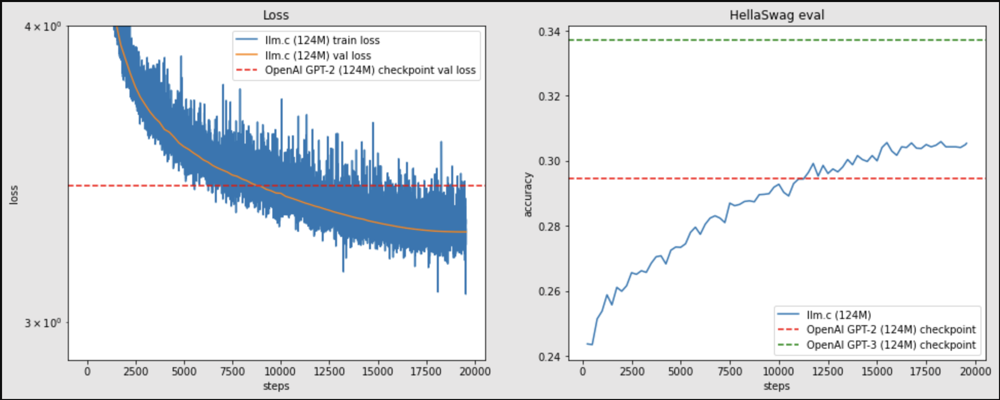

# High-Performance GPT-2 Pre-Training with CUDA

This repository showcases the pre-training of a 124M parameter GPT-2 model from scratch using an optimized CUDA implementation. The project was executed on Lambda Labs' 8xA100 40GB SXM4 GPUs, surpassing the original GPT-2 124M performance on HellaSwag (accuracy: 31.0 vs. 29.4) with a validation loss of ~3.2.



## Project Highlights

- **Efficient Training**: Achieved ~60.0% model flops utilization (MFU) on A100 GPUs.
- **Cost-Effective**: Pre-trained on 10B FineWeb tokens in ~1 hour 47 minutes for ~$20.
- **Optimizations**: Leveraged CUDA, cuBLAS, NCCL, mixed precision, Flash Attention, Kernel Fusions, ZeRO-1, State Sharding and Micro-Batch Optimizations.  

## Usage

1. **Prepare Data**:
   - Preprocess FineWeb 10B into `.bin` format.
2. **SSH into GPU instances**
3. **Train**:
   ```bash
   ./scripts/run_gpt2_124M.sh
   ```
## Future Updates

This project is a stepping stone for advanced LLM research. Planned updates include:
- **Reinforcement Learning (RL)**: Integrate RL for fine-tuning (e.g., PPO for alignment).
- **LLaMA Replication**: Build and optimize the LLaMA architecture.
- **New Architectures**: Explore scaling to larger models like GPT-3 175B.

## Acknowledgements

Inspired by Andrej Karpathy's `llm.c` repository for efficient LLM training techniques.

---

## Methodology

- **Model**: GPT-2 (12 layers, 12 heads, 768 hidden dim, 1024 seq length).
- **Data**: FineWeb dataset (binary format).
- **Training**: Mixed precision (BF16), AdamW, ZeRO-1 sharding.
- **Hardware**: 8xA100 40GB SXM4 GPUs via Lambda Labs.

## Results

- **Training Time**: ~1 hour 47 minutes.
- **Throughput**: 1.59M tokens/second.
- **MFU**: ~60.0%.
- **Cost**: ~$20.

---

# Future Updates

This project lays the groundwork for advanced LLM development. Planned updates include:

1. **Reinforcement Learning (RL)**:
   - Goal: Fine-tune with RL (e.g., PPO) for tasks like instruction following.
   - Plan: Extend the pipeline to support reward models and human feedback.

2. **LLaMA Architecture**:
   - Goal: Replicate and optimize LLaMA for efficiency and performance.
   - Plan: Adapt CUDA code for rotary embeddings and grouped-query attention.

3. **Advanced Architectures**:
   - Goal: Scale to larger models (e.g., GPT-3 175B).
   - Plan: Implement gradient checkpointing, model parallelism, and ZeRO stages 2/3.

These updates aim to enhance scalability and explore cutting-edge LLM techniques.

---

# Training Details

```bash
mpirun -np 8 ./train_gpt2cu \
    -i "dev/data/fineweb10B/fineweb_train_*.bin" \
    -j "dev/data/fineweb10B/fineweb_val_*.bin" \
    -o log124M \
    -e "d12" \
    -b 64 -t 1024 \
    -d 524288 \
    -r 1 \
    -z 1 \
    -c 0.1 \
    -l 0.0006 \
    -q 0.0 \
    -u 700 \
    -n 5000 \
    -v 250 -s 20000 \
    -h 1
```

## Hyperparameters
- `-i` and `-j` are training and validation splits token files, written by fineweb.py
- `-o` is the output directory to write logs and checkpoints into
- `-e "d12"` asks to initialize a depth 12 GPT-2 model from scratch
- `-b 64` sets the micro-batch size to 64. If you are running out of memory, decrease this value (e.g., try 32, 16, 8, down to potentially 1)
- `-t 1024` sets the maximum sequence length to 1024, matching GPT-2
- `-d 524288` requests a total batch size per update of ~0.5M tokens. The code calculates gradient accumulation accordingly. For instance, on 8 GPUs with `-b 64` and `-t 1024`, the batch is exactly 8 × 64 × 1024 = 524288 tokens, requiring no gradient accumulation. If using 1 GPU, gradient accumulation is set to 8 iterations per step to match this batch size. This size (~0.5M tokens) comes from GPT-3 guidelines.
- `-r 1` sets recomputation of GeLU activations to save memory at a slight runtime cost, allowing larger batch sizes and higher throughput
- `-z 1` activates ZeRO-1 optimizer state sharding across multiple GPUs. Recommended if using more than 1 GPU; no effect on single GPU setups
- `-c 0.1` sets weight decay to 0.1. Only 2D weights decay, matching GPT-2 and GPT-3 conventions
- `-l 0.0006` sets the maximum learning rate according to GPT-3
- `-q 0.0` decays learning rate to 0 over training duration
- `-u 700` ramps learning rate from 0 to maximum over first 700 iterations (~350M tokens), as per GPT-3
- `-n 5000` saves model checkpoints every 5000 steps
- `-v 250` evaluates and logs validation loss every 250 steps
- `-s 20000` samples tokens every 20000 steps; with fewer total steps, sampling effectively happens only at training end
- `-h 1` evaluates the HellaSwag accuracy metric for comparison across papers
