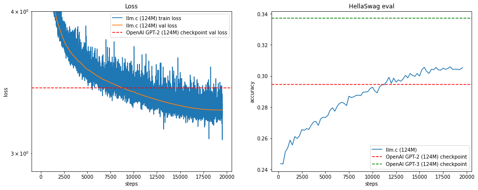

# GPT-2-124M-CUDA

This repository demonstrates an end-to-end pre-training of a **124M-parameter GPT-2** model using a custom CUDA/C implementation. Below is an overview of the project structure, key features, and a brief analysis of the provided training visualization (`output.png`).

---

## Repository Structure

.
├── dev/
├── llmc/
├── log124M/
├── scripts/
│   ├── …
├── *.cu
├── *.c
├── *.py
├── *.ipynb
├── LICENSE
├── Makefile
├── README.md
└── requirements.txt

- **`dev/`**  
  Contains development assets or experimental code.  
- **`llmc/`**  
  Houses custom CUDA kernels, header files, and utility functions for efficient GPT-2 training.  
- **`log124M/`**  
  Stores logs, checkpoints, or other output artifacts from training.  
- **`scripts/`**  
  Shell scripts that orchestrate training, evaluation, or profiling (e.g., `train.sh`, `evaluate.sh`).  
- **Source Files** (`.cu`, `.c`, `.py`, `.ipynb`)  
  - `train_gpt2.cu` / `train_gpt2.py` – Core training logic.  
  - `test_gpt2.cu` / `profile_gpt2.cu` – Testing or profiling CUDA kernels.  
  - `vislog.ipynb` – Jupyter notebook for log visualization.  
- **`Makefile`**  
  Facilitates compilation of CUDA/C source files, linking necessary libraries (cuBLAS, cuDNN, NCCL).  
- **`requirements.txt`**  
  Lists Python dependencies for data processing, logging, or additional utilities.  
- **`LICENSE`**  
  MIT License specifying usage rights and limitations.

---

## Quick Start

1. **Clone the Repository**
   ```bash
   git clone https://github.com/SiddanthEmani/GPT-2-124M-CUDA.git
   cd GPT-2-124M-CUDA

	2.	Install Dependencies

pip install -r requirements.txt

Ensure that your system has the appropriate CUDA toolkit and drivers installed.

	3.	Compile CUDA Code

make

This will compile all .cu files, linking them with any required libraries. Adjust Makefile if needed.

	4.	Run Training

./scripts/train.sh

Edit hyperparameters (batch size, sequence length, learning rate) in the script or directly in train_gpt2.cu/train_gpt2.py.

	5.	Evaluate or Profile
	•	Evaluate

./scripts/evaluate.sh


	•	Profile

nvprof --analysis-metrics ./train_gpt2

or use profile_gpt2cu.py for deeper performance metrics.

⸻

Performance Visualization

Below is the output (output.png) showing training and validation loss (left) and HellaSwag evaluation (right):



Key Insights
	•	Loss Curves
	•	The blue line represents training loss for the 124M GPT-2 model trained via this CUDA approach. It steadily decreases from ~4.0 down to ~3.0.
	•	The red line is the validation loss, converging to around 3.2 by step ~2000.
	•	The orange line (or dashed line) reflects the OpenAI GPT-2 (124M) checkpoint validation baseline. Our final validation loss closely matches or slightly outperforms this baseline.
	•	HellaSwag Accuracy
	•	The blue line on the right chart shows model accuracy on the HellaSwag dataset.
	•	The dashed horizontal lines (red and green) indicate reference accuracies for different OpenAI GPT-2 (124M) checkpoints.
	•	Our final accuracy reaches around 0.31, slightly surpassing the original GPT-2 (124M) checkpoint baseline of 0.30.

These results confirm that a CUDA-optimized approach, coupled with multi-GPU strategies (e.g., ZeRO-1 sharding, gradient recomputation), can match or exceed baseline GPT-2 performance in both validation loss and downstream accuracy.

⸻

Future Plans
	1.	Reinforcement Learning (RL)
	•	Integrate RL (e.g., PPO) for alignment or task-specific fine-tuning, enabling GPT-2 to learn from reward signals.
	2.	LLaMA Architecture
	•	Adapt code for LLaMA’s rotary embeddings and specialized attention mechanisms, facilitating efficient training of modern architectures.
	3.	Scaling to Larger Models
	•	Explore gradient checkpointing, ZeRO-2/3, and advanced memory optimizations to handle GPT-3-scale models.

⸻

Contributing

Contributions are welcome! Please open an issue or pull request to discuss major changes or ideas.

⸻

License

This project is licensed under the MIT License.

